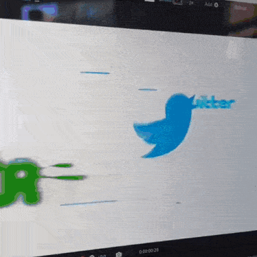
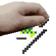

<h1> Hentai IDE </h1>

# Hentai IDE – редактор кода для настоящих мужиков!

🇷🇺 Русский

## **Hentai IDE – редактор кода для настоящих мужиков!**

Он поддерживает синтаксис **C++, Lua, Java и Python**!  
Написан мной на **Java 8**, и, чтобы скачать, перейдите **[сюда](https://github.com/niktoonion/HentaiIDE/releases/tag/alpha)**.

🇬🇧 English

## **Hentai IDE – a code editor for real men!**

It supports the syntax of **C++, Lua, Java and Python**!  
Written by me in **Java 8**, and to download it go **[here](https://github.com/niktoonion/HentaiIDE/releases/tag/alpha)**.

 
 

## Социальные сети

<!-- Указываем желаемый размер через атрибут width (можно также задать height) -->
            
